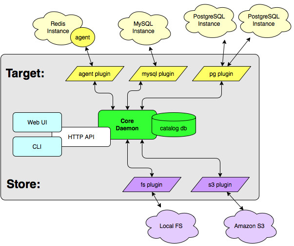
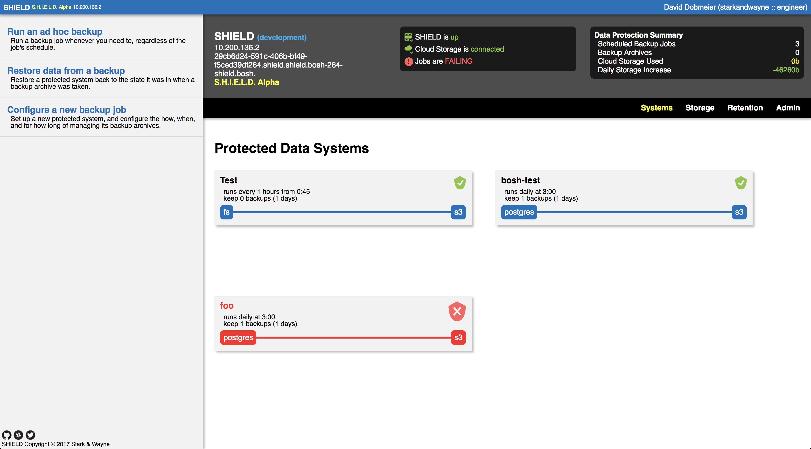
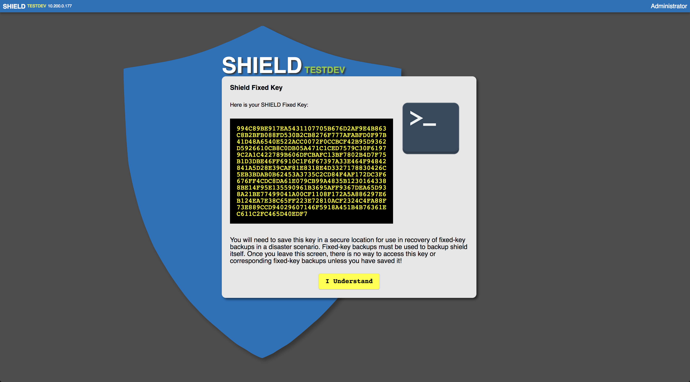

Shield Getting Started
====================

SHIELD is a data protection solution designed to make it easier for operations
to protect their critical infrastructural data. It provides primitives for
scheduling automatic backups of key systems, including PostgreSQL, MySQL,
Consul, Redis and MongoDB, as well as a means for restoring backups in the event
of an outage. Backups can be stored in a variety of cloud providers, including
S3, Scality, Microsoft Azure Blobstore, and more.

## Deploying SHIELD

Currently there are four ways to get a Shield up and running: Using genesis to
deploy to BOSH, deploying a template manifest directly to BOSH, spinning up a
docker environment, and running a local development environment. While the
Docker and Local versions of Shield are useful for demo, testing, and
development, they are **not** recommended to use either in a prodiction
capacity.

#### Genesis

We'll start out with the Genesis template for SHIELD:

    $ cd ~/ops
    $ genesis init -k shield
    $ cd shield-deployments
    $ genesis new us-east-prod

This will prompt for parameters required to deploy shield such as
authentication, static IP, etc.

Once finished, if OAuth Provider authentication was selected, open the
us-east-prod.yml file that was generated and under the "authentication"
section fill out the mapping from oauth-/>tenants using the example
provided below.

    authentication:
    - name:       Github
      identifier: github
      backend:    github
      properties:
        client_id:     client-id-here
        client_secret: client-secret-here
        mapping:
          - github: starkandwayne  # <-- github org name
            tenant: starkandwayne  # <-- shield tenant name
            rights:
              - team: Owners       # <-- github team name
                role: admin        # <-- shield role name
              - team: Engineering  #   (first match wins)
                role: engineer
              - role: operator     # = (default match)

          - github: starkandwayne
            tenant: SYSTEM
            rights:
              - team: Engineering
                role: admin

          - github: cloudfoundry-community
            tenant: CF Community
            rights:
              - role: engineer
    - name:       UAA
      identifier: uaa1
      backend:    uaa
      properties:
        client_id:       shield-dev
        client_secret:   s.h.i.e.l.d.
        uaa_endpoint:    https://10.244.156.2:8443
        skip_verify_tls: true
        mapping:
          - tenant: UAA          # <-- shield tenant name
            rights:
              - scim: uaa.admin  # <-- uaa scim right
                role: admin      # <-- shield role
                                #   (first match wins)
              - scim: cloud_controller.write
                role: engineer
              - role: operator   # = (default match)
          - tenant: UAA Admins Club
            rights:
              - scim: uaa.admin
                role: admin

Time to deploy!

    $ genesis deploy us-east-prod
    Acting as user 'admin' on 'us-east-prod-bosh'
    Checking whether release shield/8.0.6 already exists...NO
    Using remote release `https://github.com/starkandwayne/shield-boshrelease/releases/download/v8.0.6/shield-8.0.6.tgz'

    Director task 13
      Started downloading remote release > Downloading remote release

Once that's complete, you will be able to access your SHIELD
deployment, and start configuring your backup jobs via the WebUI or CLI
accessable at the IP you specified for SHIELD.

#### Bosh Manifest Template

If a direct manifest deployment is preferred, example manifests, opsfiles, and
more information can be found here:
https://github.com/starkandwayne/shield-boshrelease/tree/master/manifests

This manifest can be deployed using the following commands:

    $ cd ~/ops
    $ git clone git@github.com:starkandwayne/shield-boshrelease.git
    $ cd shield-boshrelease
    $ bosh -e us-east-prod-bosh -d shield deploy manifests/shield.yml --vars-store=./tmp/creds.yml -v static_ip=10.244.9.2 -v domain=10.244.20.2

If OAuth login for Shield is desired, see the above configuration under the
genesis section copy and modify the configuration under `authentication:` and
add it to the manifest under the `properties.core.authentication:` key.

After the deployment finishes, shield will be accessabile via https://10.244.9.2
(the static IP selected for deployment in this case)
#### Docker

Running shield from docker-compose is a great way to test out shield as it comes
preconfigured with test targets, storage systems, tenants, and users to give a
good idea of what shield looks like in a production environment.

To start Shield via docker-compose:

    $ cd ~/ops
    $ git clone git@github.com:starkandwayne/shield.git
    $ cd shield/demo
    $ ./build
    $ docker-compose up

After docker-compose finishes spinning up all of the containers, shield should
be accessible from http://localhost:8181, webdav from http://localhost:8182, an
example ERP/CRM suite on http://localhost:8183, and an example ticketing system
on http://localhost:8184. The example systems can be backed up and restored via
shield as a demo.

#### Local Development

If you are looking to contribute to Shield, a local development environment is
necessary for quick testing and iteration. To set up a local dev environment on
mac or linux:

    $ cd ~/ops
    $ git clone git@github.com:starkandwayne/shield.git
    $ cd shield
    $ make all
    $ make dev

When running `make dev` if there is a dependency required (i.e. tmux) you will
be notified. `make dev` runs tmux with several windows giving you insight into
different parts of shield with debugging logs. Shield itself will be accessable
from http://localhost:8181

## Deploying SHIELD Agents

To deploy SHIELD a shield agent via a new genesis deployment, simply
answer `yes` to
`Do you want to install SHIELD on your <deployment> for backups?` and
answer the questions that follow. If you do not yet have a SHIELD
deployed, you would say `no` to the above question and use the method
below to deploy SHIELD agents.

If you are adding an agent to an existing genesis deployment, modify the
<environment\>.yml file and add the following parameters.

    kit:
        subkits:
        - existing subkits
        - ...
        - shield
        - shield-<database-type> #<- this is only for CF with an internal DB

    params:
        #Existing Parameters
        ...

        # This is usually something like `secret/path/to/keys/for/shield/agent:public`
        # If you are unsure, use `safe tree` to find it.
        shield_key_vault_path: secret/path/to/keys/for/shield/agent:public

        # This is usually something like `secret/path/to/keys/for/shield/certs/ca:certificate`
        # If you are unsure, use `safe tree` to find it.
        shield_ca_vault_path: secret/path/to/keys/for/shield/certs/ca:certificate

        # This is usually something like "https://shield.example.com" or "https://xxx.xxx.xxx.xxx"
        shield_core_url: https://192.168.10.121

#### Adding SHIELD Agents to manual bosh manifests

To add a shield agent to a bosh deployment, add the following to the manifest
under `jobs`.

    - name: shield-agent
      release: shield
      consumes:
        shield: {from: shield}
      properties:
        core:
          ca: ((shield-tls.ca))

In addition to adding the shield agent job, ensure to add the shield release and
any other custom parameters required for your environment (Proxy/etc)

## How to Use SHIELD

Backup jobs for SHIELD are created and maintained in the SHIELD UI:

To access the SHIELD UI, go to <https://shield-ip>. The default user
name is `admin` and the default password is `shield`. We recommend
changing this passowrd and then also storing it in a password manager
for convenience.

Upon first login, SHIELD with be uninitialized and require a master
password. This master password is used to unseal SHIELD and the internal
encryption key storage used to perform backups. Ensure this password is
saved in a password manager and/or vault as there is no way to recover
or reset this password if it is forgotten. The master password can also
be rotated under the Admin section of the WebUI or via the CLI. Also,
whenever SHIELD is redeployed or the SHIELD daemon is restarted, it will
come up in a `Locked` state and prompt admin users for the master
password. While in this state, backups will not be scheduled and running
backups or restores manually will fail until SHIELD is unsealed. The
current status of SHIELD is displayed in the HUD at the top of the
WebUI.

Upon entering the master password you will be directed to the above screen. This
is the SHIELD key used for the recovery of fixed-key encrypted backups. To
backup SHIELD itself, you must use the fixed-key option to be able to recover
and decrypt the archive in the event of a disaster. This is due to the fact that
the internal encryption key storage is part of shield itself. Before leaving
this screen you must save this key in vault or a password manager as there is no
way to recover this key once you acknowledge. The key can be rotated when you
rotate the master key, however the current key can not be recovered after
navigating away from this screen.

**Configuring Users and Tenants**

When Shield is first deployed it will have one user (admin) and one tenant
(tenant1). The default tenant (tenant1) is used for migrations from shield v6/v7
to shield v8 and all legacy jobs will belong to tenant1 upon migration to Shield
v8. If configuring a new shield it is recommended to leave the default tenant
alone, and create a new tenant for all new configuration.

First, click the `Admin` tab and then `Local User Management`. From this
interface, create any new users required and set their System Role.

Next, navigate back to the `Admin` tab and select `Tennants`. This interface is
used to create and manage existing tenants. Select `Create a New Tenant`, fill
out a name, and add users created in the previous step to the new tennant. This
is also the time to set the users role within the tenant.

User Sessions can also be managed from the `Admin` tab and cleared if necessary.
Whenever Shield is restarted, all sessions will be cleared and users will be
forced to log in again.

**Configuring A Job**

To configure SHIELD backup jobs, on the left hand sidebar select the
Configure a new backup job menu option. From here it will guide you
through a wizard to set up targets, schedules, retention policies, and
storage systems.

For this example we will backup SHIELD itself to Amazon S3. The name for
this target will be SHIELD, Notes can include the reasoning for using
fixed-key encryption or other target specifc things other operators may
need to know when editing the job in the future.

For the agent, we will select
`us-east-prod-shield/shield@z1/0 (at 192.168.10.121:5444)`. This is the
agent that resides on the SHIELD and will be used to backup SHIELD
itself. Generally an agent is installed on the same instance as the
service intended to be backed up. (More on this later)

The plugin used to backup SHIELD is Local Filesystem Plugin (fs). Once
selected, the parameters specfic to the plugin will be displayed below
for plugin configuration. In this case, the Base Directory is
/var/vcap/store/shield, Files to Include/Exclude can remain blank, and
Fixed-Key Encryption must be checked for reasons stated above. Once
these parameters are filled in, click next.

Next, select a schedule for this jub to run. There are actually quite a
few parameters available allowing you to create backups that are
`hourly`, `daily`, `weekly`, or `monthly`. Here are some additional
backup schedules to show their behaviors: "every 4 hours from 12:15",
"thursdays at 23:35", "3rd Tuesday at 2:05", and "monthly at 2:05
on 14th". After selecting an appropriate schedule, click next.

Now that you have a backup schedule, we're going to create a
**retention policy** as well. With retention policies it is helpful to
include the duration in the policy name. The duration is given in days,
so if you wanted to keep a given backup for a year you'd use `365` and
perhaps name the policy "1 year retention".

Something to consider: people usually like comparing "this time, last
period" backups. By that we mean "I wonder what X looked like this
time last year" or "I wonder what last Monday looked like", so you
might want to consider making your 1 year backups actually 13 months or
your weekly backups 8 days. (And so on.)

Next up is configuring **sotrage systems** for the backup archives.
Currently SHIELD has s3, gcp, azure, swift, and webdav plugins for
storage. For this example, we will use Amazon S3. Select a name for the
storage system to be used for configuring future jobs and managing the
storage system. Add any necessary notes and set a threshold for storage.
This threshold will be used to warn via the HUD and storage tab when
total archive size on that system reaches the threshold. For agent we
will use the same one that we used to configured that target. Plugin
will be `Amazon S3 Storage Plugin (s3)` with the required parameters
being `Access Key ID`, `Secret Access Key`, and `Bucket Name`. While
optional, it can be useful to use the Bucket Path Prefix parameter to
organize backups in the bucket if you plan on using this bucket for
other storage systems, services, etc. After filling out the parameters,
click next.

At this point the new backup job is ready for review, notes, and a name.
If something is incorrect, simply click the part you wish to change and
reconfigure it to resolve the issue. Once satisfied with everything,
click save to create the job.

When creating new jobs, the target and storage system created for previous jobs
will be accessible should you want to reuse a storage system, target, or
retention policy.

**Other Notes**

In addition to running at the scheduled time, you can run a job at any
time by clicking the target on the systems page and then `run now` or
via `Run an ad hoc backup` on the left side menu. Jobs can also be
paused by using the SHIELD CLI with WebUI support coming soon. This
means that the job will not run at its scheduled time(s) until it is
unpaused.

In order to **restore** a given backup, select
`Restore data from a backup` on the left side menu. You can filter your
backup jobs and associated archives by target name. The **Systems** page
gives a list of the most recent tasks and their durations. Initially,
most tasks are expected to have a very short duration but as time goes
on and your environment grows you will notice the time required for the
various backups will increase.

**Backing Up Other Services**

This section will list the target configuration for other services. That
said, these parameters may vary from environment to environment and
parameters may have asterisks denoting notes below to clarify these
cases. Also, parameters denoted as `blank` can be left blank as they are
optional in most cases, however they can be configured if necessary.

**Bosh Director Backup** :

    "Name": "Bosh"
    "Notes": "Bosh Director Backup"
    "Agent": "us-east-prod-bosh/bosh"
    "Backup Plugin": "PostgreSQL Backup Plugin (postgres)"
    "PostgreSQL Host": "127.0.0.1"
    "PostgreSQL Port": "5432"
    "PostgreSQL Username": "vcap"
    "PostgreSQL Password": ""*
    "Database to Backup": <blank>
    "Path to PostgreSQL bin/directory": "/var/vcap/packages/postgres/bin/"*
    "Fixed-Key Encryption?": <unchecked>

For `PostgreSQL Password` enter the literal two quote characters `""`.
This is essentially an empty string as the vcap user does not require a
password.

`Path to PostgreSQL bin/directory` may vary from release to release.
Verify this via ssh to the bosh director and check the
`/var/vcap/packages` folder for the proper version of postgres and the
bin directory.

**Concourse** :

    "Name": "Concourse"
    "Notes": "Concourse Backup"
    "Agent": "us-east-prod-concourse/db"
    "Backup Plugin": "PostgreSQL Backup Plugin (postgres)"
    "PostgreSQL Host": "127.0.0.1"
    "PostgreSQL Port": "5432"
    "PostgreSQL Username": "vcap"
    "PostgreSQL Password": ""*
    "Database to Backup": <blank>
    "Path to PostgreSQL bin/directory": "/var/vcap/packages/postgres/bin/"*
    "Fixed-Key Encryption?": <unchecked>

For `PostgreSQL Password` enter the literal two quote characters `""`.
This is essentially an empty string as the vcap user does not require a
password.

`Path to PostgreSQL bin/directory` may vary from release to release.
Verify this via ssh to the bosh director and check the
`/var/vcap/packages` folder for the proper version of postgres and the
bin directory.

**Cloud Foundry Backup** :

    "Name": "Cloud Foundry"
    "Notes": "Cloud Foundry Backup"
    "Agent": "us-east-prod-cf/db"
    "Backup Plugin": "PostgreSQL Backup Plugin (postgres)"
    "PostgreSQL Host": "127.0.0.1"
    "PostgreSQL Port": "5432"
    "PostgreSQL Username": "shield"
    "PostgreSQL Password": <found in vault>*
    "Database to Backup": <blank>
    "Path to PostgreSQL bin/directory": "/var/vcap/packages/postgres/bin/"*
    "Fixed-Key Encryption?": <unchecked>

The `PostgreSQL Password` can be found in vault under the cf tree in the
/postgres path. The key will be `shield_password`. For example
`secret/us/east/prod/cf/postgres:shield_password` or similar.

`Path to PostgreSQL bin/directory` may vary from release to release.
Verify this via ssh to the bosh director and check the
`/var/vcap/packages` folder for the proper version of postgres and the
bin directory.

**Vault** :

    "Name": "Vault"
    "Notes": "Vault Backup"
    "Agent": "us-east-prod-vault/vault"
    "Backup Plugin": "Consul Backup Plugin (consul)"
    "Consul Host/Port": "https://127.0.0.1:8500"
    "Skip SSL Validation": <unchecked>
    "Consul Username": <blank>*
    "Consul Password": <blank>*
    "Fixed-Key Encryption?": <unchecked>

`Consul Username` and `Consul Password` are blank in most Vault
deployments if this is not the case in your environment, update
accordingly.

SHIELD currently has plugins for Redis, Mongo, Elasticsearch, and
others. To see more information about the plugin list and relevant
documentation, please check out the [SHIELD
README](https://github.com/starkandwayne/shield).