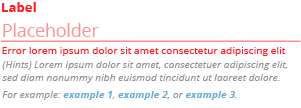

SHIELD Plugins
==============

(*Note:* a ton more stuff needs to go here)

Plugin Configuration Metadata
-----------------------------

Plugins have configuration, and that configuration has to conform
to what the plugin code is expecting to find, or nothing works.

To make it easier for operators to properly configure their backup
jobs, each plugin executable needs to be able to describe what
information it needs, provide hints on where one might find that
information, explain what format that information must be in, etc.

This is called **plugin configuration metadata**

It looks something like this:

```
[
  {
    "name"        : "s3_host",
    "label"       : "S3 Host",
    "required"    : false,
    "placeholder" : "s3.amazonaws.com",
    "type"        : "string",
    "help"        : "If you use something other than Amazon S3 itself, you will need to provide the name/address of the storage solution.",
    "examples"    : [ "192.168.99.43", "storage.example.com" ]
  },
  {
    "name"         : "s3_port",
    "label"        : "S3 Port",
    "placeholder"  : "(auto-detect)",
    "required"     : false,
    "type"         : "string",
    "format"       : "^\d+$",
    "help"         : "If your non-AWS solution runs on a non-standard port (i.e. not 80/443), you will need to provide it.",
    "examples"     : ["9920", "4443", "8080"]
  },
  {
    "name"     : "s3_access_key",
    "label"    : "Access Key ID",
    "required" : true,
    "missing"  : "Your Access Key ID is required to authenticate to S3",
    "type"     : "string"
  },
  ...
]
```

Each element in the list is a map describing exactly one field.
The order of the fields is significant; the SHIELD UIs will honor
it when rendering its form (web UI) or asking questions (CLI).

The following fields are valid for a field definition:

#### name

The internal name of the field.  This will be used to generate the
endpoint configuration.  It will never be shown to the end user.

This field is required.

#### label

A display name of the field.  UIs can use this to prompt the user,
either via forms or CLI.  This value will almost always be sent to
the end user.

This field is required.

#### required

A boolean that determines whether or not the end user can leave
this field blank.  Blank fields will _not_ be set in the endpoint
configuration JSON (their keys will be omitted entirely).

This field is required, on the pretense that it is better to be
explicit about what needs filled in.

#### placeholder

Placeholder text that can be used in (at least) the Web UI HTML
forms for configuring this plugin.  It should either convey the
default value, or explain what the default behavior is.  For
example, if the S3 plugin's default `s3_host` parameter is
"s3.amazonaws.com", that would be a suitable placeholder.  On the
other hand, the PostgreSQL plugin defaults to backing up all
database unless `pg_database` is set, so a placeholder of "(all
databases)" (note the parentheses) would be appropriate.

This field is not required; if not present, there will be no
placeholder text.  Required fields with straightforward semantics,
like a _Username_ field, do not need placeholder text.

#### type

The type of data, indicating what type of form field should be
presented to the user.  Valid types are:

- **text** - A (usually short) single-line string.  For the web
  UI, this would be displayed as an `<input type="text">` HTML
  form field, and the CLI might read from standard input until a
  newline is reached.
- **password** - Like "text", but sensitive.  Whatever the user
  enters into this field should not be visible.
- **multiline** - A (possibly long) multi-line field that may
  contain embedded newline characters.
- **number** - Like "text" (for presentation), but the
  configuration parameter must be sent as a bare numeric, not a
  quoted string.
- **boolean** - A yes/no proposition, sent to the backend as a
  boolean true / false value.  The web UI will display this as a
  checkbox; the CLI will ask a "yes/no" question.

#### format

For text-based fields (`text`, `password`, and `multiline`), the
"format" key lets the plugin author provide a regular expression
for evaluating the entered value against.  If it does not match,
the `invalid` message (see below) will be printed as an error.

Note: this is not a substitute for proper input validation and
sanitation in the plugin code itself; it exists solely to provide
early feedback to operators on what is and is not acceptable to
the plugin.

This field is optional.

#### invalid

Provides a message for format validation errors.

This field is required, but only if the `format` field is
specified.

#### help

A helpful couple of sentences that explains what the field is used
for, what one might want to put in it, what format is expected,
etc.

#### examples

A list of example values, because some people work better with
examples than descriptions.

### Web UI Form Field Display Example

Here is an example of a field, as displayed in the Web UI, as an
element of an HTML form:


and here is an example of a field with an error:



### CLI Form Field Display Example

Here is an example of a field, as displayed in the Web UID:

```
Label
  (Hints) Lorem ipsum dolor sit amet, consectetur adipisciing
  elit, sed diam nonummy nibh euismod tincidunt ut laoreet dolore

  For example: example 1, example 2, or example 3

Label:
Placeholder> _
```

(this is just a mockup, I'm not entirely convinced that all the
 extra text is justified / justifiable)

