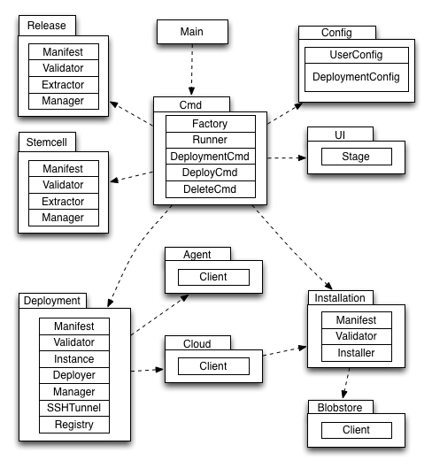
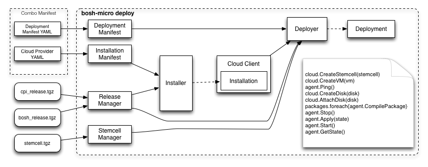
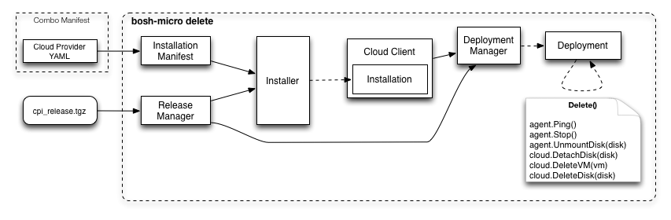

## Architecture

### Package Diagram

The following diagram describes the primary packages, their salient classes/subpackages, and their interdependencies.

### Deploy Command Flow

The deploy command consumes:

1. combo manifest (installation & deployment manifests)
1. stemcell (root file system)
1. CPI release
1. BOSH release

The deploy command produces:

1. a local installation of the CPI
1. a remote deployment of BOSH (and its multiple jobs) on a single VM or container on the cloud infrastructure targeted by the CPI

### Delete Command Flow

1. combo manifest (installation manifest)
1. CPI release

The deploy command produces: a local installation of the CPI.

The deploy command deletes: previously deployed remote VM, disk(s), & stemcell.

